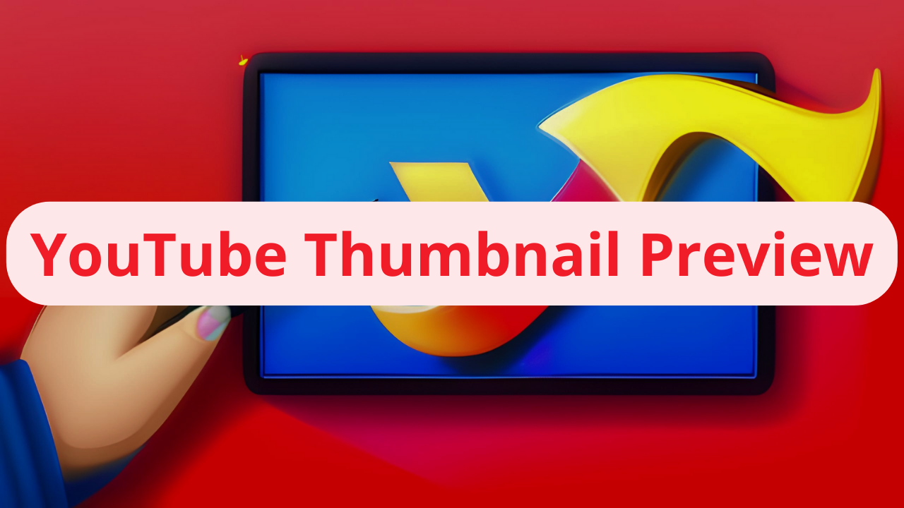

# Youtube Tumbnail Preview

This browser extension allows you to replace the thumbnail image and title of YouTube videos on the homepage with your own custom thumbnail and title.

## Features

- Replace one randomly selected thumbnail and title among the first 7 videos on YouTube's homepage.
- Customize thumbnail and title using the popup interface.
- Enable and disable thumbnail and title replacement without having to reload the page.
- Remember the selected image and custom title even after closing the popup.

## Installation

The add-on is easily installed through the Google store using this link : [COMING SOON]

## Usage

1. Click on the extension icon in the browser's toolbar.
2. Use the file input to select a custom thumbnail image.
3. Enter a custom title in the text input.
4. Check the "Activate replacement" checkbox to enable the extension.
5. Browse YouTube's homepage and see the randomly selected thumbnail and title replaced with your custom thumbnail and title.

## Contributing

Contributions to improve this extension are welcomed. Please feel free to open issues or submit pull requests.

## License

This project is licensed under the MIT License.

## Credits

Addon created by [Bochi](https://twitter.com/0xbochi) • [LinkedIn](https://www.linkedin.com/in/luckasbosch/)
